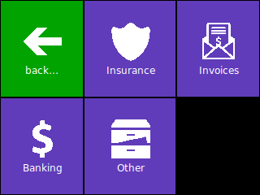

PiMenu
======

This is a simple fullscreen menu system written in Python TKInter. It has been
developed with a Raspberry Pi Touchscreen in mind and is optimized for small
screens (320x240 is assumed).

The design is inspired by Windows 8's Metro design. Tiles are configured in
```pimenu.yaml```, they can either open new pages of tiles or execute the action
script ```pimenu.sh``` to execute arbitrary tasks.

On the Raspberry, install python-yaml:

    sudo apt-get install python-yaml

Copy the example configs before running the script:

    cp pimenu.yaml{.dist,}
    cp pimenu.sh{.dist,}

The app can be started in fullscreen by passing ```fs``` as first parameter.

    ./pimenu.py fs



License
-------

Copyright (c) 2014-2017 Andreas Gohr

Permission is hereby granted, free of charge, to any person obtaining a copy
of this software and associated documentation files (the "Software"), to deal
in the Software without restriction, including without limitation the rights
to use, copy, modify, merge, publish, distribute, sublicense, and/or sell
copies of the Software, and to permit persons to whom the Software is
furnished to do so, subject to the following conditions:

The above copyright notice and this permission notice shall be included in
all copies or substantial portions of the Software.

THE SOFTWARE IS PROVIDED "AS IS", WITHOUT WARRANTY OF ANY KIND, EXPRESS OR
IMPLIED, INCLUDING BUT NOT LIMITED TO THE WARRANTIES OF MERCHANTABILITY,
FITNESS FOR A PARTICULAR PURPOSE AND NONINFRINGEMENT. IN NO EVENT SHALL THE
AUTHORS OR COPYRIGHT HOLDERS BE LIABLE FOR ANY CLAIM, DAMAGES OR OTHER
LIABILITY, WHETHER IN AN ACTION OF CONTRACT, TORT OR OTHERWISE, ARISING FROM,
OUT OF OR IN CONNECTION WITH THE SOFTWARE OR THE USE OR OTHER DEALINGS IN
THE SOFTWARE.

Icons
-----

The install comes wih a bunch of icons with their own licenses as listed below:

* bunny.gif     CC-by   http://thenounproject.com/term/rabbit/26062/
* invoice.gif   CC-by   http://thenounproject.com/term/invoice/60884/
* ambulance.gif PD      http://thenounproject.com/term/ambulance/597/
* medical.gif   CC-by   http://thenounproject.com/term/medical/35773/
* grave.gif     CC-by   http://thenounproject.com/term/grave/29403/
* fish.gif      CC-by   http://thenounproject.com/term/fish/19775/
* all others    CC-by   http://modernuiicons.com/
